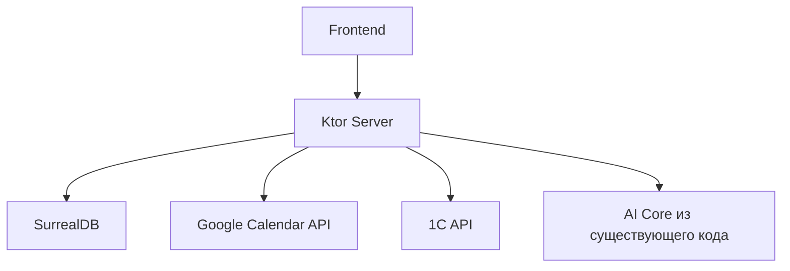

## 1. Подготовительный этап

### 1.1. Определение архитектуры
- **Стек технологий**:
  - Бэкенд: Ktor на Kotlin
  - Фронтенд: HTML+CSS
  - БД: SurrealDB
  - Интеграции: Google Calendar API, 1С API
- **Схема взаимодействия**:

### 1.2. Перенос существующего кода
1. **Адаптация AI ядра**:
   - Вынос классов `DialogSession`, `CompanyData` и др. в отдельный модуль `core`
   - Рефакторинг `SessionManager` для работы с SurrealDB
## 2. Бэкенд разработка

### 2.1. Настройка базового сервера

1. **Инициализация Ktor**:
```kotlin
// Application.kt
fun main() {
    embeddedServer(Netty, port = 8080) {
        install(ContentNegotiation) {
            json(Json {
                prettyPrint = true
                ignoreUnknownKeys = true
                explicitNulls = false
            })
        }
        configureRouting()
    }.start(wait = true)
}
```

2. **Подключение SurrealDB**:
```kotlin
// Database.kt
val db = Surreal("memory").apply {
    connect()
    use("test", "test")
}

// Перенос SessionManager
class SurrealSessionManager(private val db: Surreal = Database.db) {
    suspend fun saveSession(session: DialogSession) {
        db.query("""UPDATE session:${session.sessionId} CONTENT ${json.encodeToString(session)}""")
    }
}
```

### 2.2. Реализация API endpoints

1. **Базовые маршруты**:
```kotlin
// Routing.kt
fun Application.configureRouting() {
    routing {
        route("/api") {
            post("/session") {
                val session = call.receive<DialogSession>()
                SessionManager().saveSession(session)
                call.respond(HttpStatusCode.Created)
            }
            
            get("/company") {
                val companyData = DataLoader().loadCompanyData()
                call.respond(companyData)
            }
        }
    }
}
```

2. **AI Endpoint**:
```kotlin
post("/ask") {
    val question = call.receiveText()
    val companyData = DataLoader().loadCompanyData()
    
    val response = runBlocking {
        val agent = createAgent(companyData) // Текущий код инициализации AIAgent
        agent.llmContext.writeSession {
            updatePrompt { user(question) }
            requestLLM()
        }
    }
    
    call.respond(mapOf("answer" to response.content))
}
```

### 2.3. Интеграция с SurrealDB

1. **Модели данных** (расширение существующих):
```kotlin
// Models.kt
@Serializable
@SurrealTable("session")
data class SurrealSession(
    val id: String = "session:${DialogSession.generateSessionId()}",
    val prompt: String,
    val messageCount: Int
) {
    fun toDialogSession() = DialogSession(
        sessionId = id.removePrefix("session:"),
        prompt = Prompt.Empty, // Необходима адаптация
        messageCount = messageCount
    )
}
```

2. **Репозиторий**:
```kotlin
class SessionRepository {
    suspend fun getById(id: String): DialogSession? {
        return db.query("SELECT * FROM $id")
            .first()
            ?.toDialogSession()
    }
}
```

### 2.4. Настройка аутентификации

1. **JWT Auth**:
```kotlin
install(Authentication) {
    jwt {
        realm = "onboarding-assistant"
        verifier = JWT.require(Algorithm.HMAC256("secret"))
            .withAudience("users")
            .build()
        validate { credential ->
            if (credential.payload.getClaim("username").asString() != "") {
                JWTPrincipal(credential.payload)
            } else null
        }
    }
}
```
### Чек-лист этапа:
1. [ ] Сервер отвечает на /api/company
2. [ ] Сохранение сессии в SurrealDB
3. [ ] Работающий /ask endpoint
4. [ ] JWT auth
## 3. Работа с данными

### 3.1. Проектирование структуры БД (SurrealDB)

1. **Схема на основе существующих классов**:
```sql
-- Определение таблиц
DEFINE TABLE company SCHEMALESS;
DEFINE FIELD name ON company TYPE string;
DEFINE FIELD foundingYear ON company TYPE number;
DEFINE FIELD mission ON company TYPE string;
DEFINE FIELD values ON company TYPE array;

DEFINE TABLE department SCHEMALESS;
DEFINE FIELD name ON department TYPE string;
DEFINE FIELD head ON department TYPE string;
DEFINE FIELD teamSize ON department TYPE number;
DEFINE FIELD company ON department TYPE record(company);

-- Связи
DEFINE INDEX company_departments ON department FIELDS company;
```

2. **Перенос данных из JSON**:
```kotlin
// DataMigration.kt
suspend fun migrateCompanyData(db: Surreal, data: CompanyData) {
    db.query("CREATE company CONTENT ${Json.encodeToString(data.company)}")
    
    data.company.departments.forEach { dept ->
        db.query("""
            CREATE department CONTENT {
                name: "${dept.name}",
                head: "${dept.head}",
                teamSize: ${dept.teamSize},
                company: company:${data.company.name}
            }
        """)
    }
}
```

### 3.2. Реализация репозиториев

1. **CompanyRepository**:
```kotlin
class CompanyRepository(private val db: Surreal) {
    suspend fun getCompany(): CompanyData {
        val company = db.query("SELECT * FROM company LIMIT 1")
            .first()
            ?.let { Json.decodeFromString<Company>(it) }
            ?: throw IllegalStateException("Company not found")
        
        val departments = db.query("SELECT * FROM department WHERE company = \$company", 
            mapOf("company" to "company:${company.name}"))
            .map { Json.decodeFromString<Department>(it) }
        
        return CompanyData(
            company = company.copy(departments = departments),
            projects = emptyList(),
            contacts = loadContacts(db),
            developmentStandards = loadStandards(db)
        )
    }
}
```

2. **SessionRepository**:
```kotlin
class SessionRepository(private val db: Surreal) {
    suspend fun saveSession(session: DialogSession) {
        db.query("""
            UPDATE session:${session.sessionId} 
            CONTENT {
                prompt: ${session.prompt.toJson()},
                messageCount: ${session.messageCount},
                lastUpdated: time::now()
            }
        """)
    }
    
    suspend fun getSession(sessionId: String): DialogSession? {
        return db.query("SELECT * FROM session:\$id", 
            mapOf("id" to sessionId))
            .first()
            ?.let { Json.decodeFromString(it) }
    }
}
```

### 3.3. Миграции данных

1. **Скрипт миграции**:
```kotlin
// MigrationRunner.kt
suspend fun runMigrations(db: Surreal) {
    // Проверяем версию
    val version = db.query("SELECT version FROM schema_meta LIMIT 1")
        .first()
        ?.get("version")?.asInt() ?: 0
    
            db.query("DEFINE TABLE company SCHEMALESS")
            db.query("DEFINE TABLE department SCHEMALESS")
            migrateCompanyData(db, DataLoader().loadCompanyData())
            db.query("CREATE schema_meta CONTENT { version: 1 }")
    }
}
```

2. **Тестовые данные**:
```kotlin
suspend fun seedTestData(db: Surreal) {
    db.query("""
        CREATE company:test CONTENT {
            name: "Test Company",
            foundingYear: 2023,
            mission: "Test mission",
            values: ["value1", "value2"]
        }
    """)
}
```

### Чек-лист этапа:
1. [ ] Все сущности из CompanyData перенесены в SurrealDB
2. [ ] Репозитории возвращают данные в исходном формате
3. [ ] Миграции выполняются при старте приложения
4. [ ] Тестовые данные доступны в базе
## 4. Фронтенд разработка

#### 4.1. Интеграция с Ktor
```html
<div id="chat-container">
  <div id="messages"></div>
  <input type="text" id="user-input" placeholder="Задайте вопрос...">
  <button onclick="sendMessage()">Отправить</button>
</div>

<script>
async function sendMessage() {
}
</script>
```
### 4.2. Интеграция с AI
Связать взаимодействия с интерфейсом с ИИ
```javascript
async function sendToAI(message) {
  const response = await fetch('/api/ask', {
    method: 'POST',
    headers: {
      'Content-Type': 'application/json',
      'X-Session-Id': getSessionId()
    },
    body: JSON.stringify({
      message: message,
      companyContext: window.companyData
    })
  });
  return await response.json();
}
```
### Чек-лист этапа:
1. [ ] Основной интерфейс чата работает
2. [ ] Интеграция с backend
3. [ ] Отображение прогресса онбординга
## 5. Интеграции

### 5.1. Google Calendar API

#### 5.1.1. Настройка OAuth 2.0
1. **Конфигурация авторизации** (адаптация под Ktor):
```kotlin
// GoogleAuth.kt
class GoogleCalendarService(
    private val credentialsStream: InputStream = File("credentials.json").inputStream()
) {
    private val scopes = listOf(CalendarScopes.CALENDAR)
    private val jsonFactory = JacksonFactory.getDefaultInstance()
    
    fun getCredentials(token: String): Credential {
        return GoogleCredential()
            .setAccessToken(token)
            .setExpiresInSeconds(3600L)
    }
    
    fun createEvent(sessionId: String, event: Event) {
        val calendar = Calendar.Builder(
            NetHttpTransport(),
            jsonFactory,
            getCredentials(getStoredToken(sessionId))
            .setApplicationName("Onboarding-Assistant")
            .build()
        
        calendar.events().insert("primary", event).execute()
    }
}
```

### 5.2. Интеграция с 1С
Настроить использование API для взаимодействия с 1С
### 5.3. Адаптация существующего AI ядра с интеграциями
Использовать созданные классы как tools для внедрения ИИ

### Чек-лист этапа:
1. [ ] Создание событий в Google Calendar через API
2. [ ] Получение данных сотрудника из 1С
## 5. Тестирование

### 5.1. Модульное тестирование

#### 5.1.1. Тестирование репозиториев
Написать тесты для тестирование работоспособности базы данных

#### 5.1.2. Тестирование AI ядра
Написать тесты для тестирование работоспособности ии модулей

### 5.2. Интеграционное тестирование

#### 5.2.1. Тестирование интеграций
Написать тесты для тестирование работоспособности внешних сервисов
### 5.4. Нагрузочное тестирование

```kotlin
class LoadTest {
    fun `handle multiple sessions`() = runBlocking {
        val agents = (1..100).map {
            async {
                AIAgent().apply {
                    llmContext.writeSession {
                        updatePrompt { user("test $it") }
                        requestLLM()
                    }
                }
            }
        }
        assertTrue(agents.awaitAll().all { it.lastResponse != null })
    }
}
```

### Чек-лист этапа:
1. [ ] Покрытие кода тестами
2. [ ] Интеграции с 1С и Google Calendar проверены
## 6. Деплой и документация

#### 6.1. Docker Compose
```yaml
# docker-compose.yml
version: '3.8'

services:
  app:
    build: .
    ports:
      - "8080:8080"
    depends_on:
      - surreal
    environment:
      SURREALDB_URL: "http://surreal:8000"
      SURREALDB_USER: "root"
      SURREALDB_PASS: "root"

  surreal:
    image: "surrealdb/surrealdb:latest"
    ports:
      - "8000:8000"
    command: "start --log trace --user root --pass root file://data.db"
```

### Чек-лист этапа:
1. [ ] Docker-образ успешно собирается
2. [ ] Локальное развертывание через docker-compose