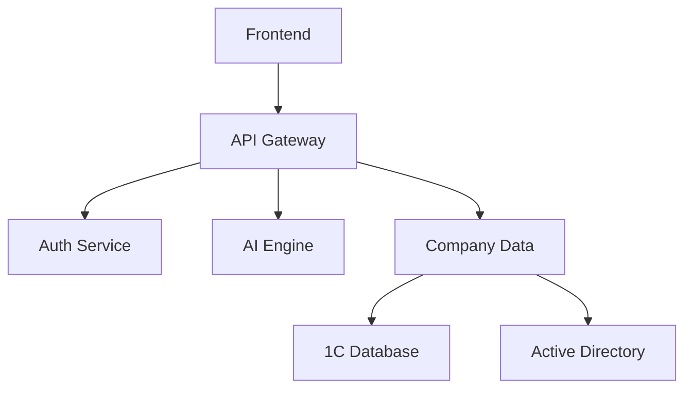
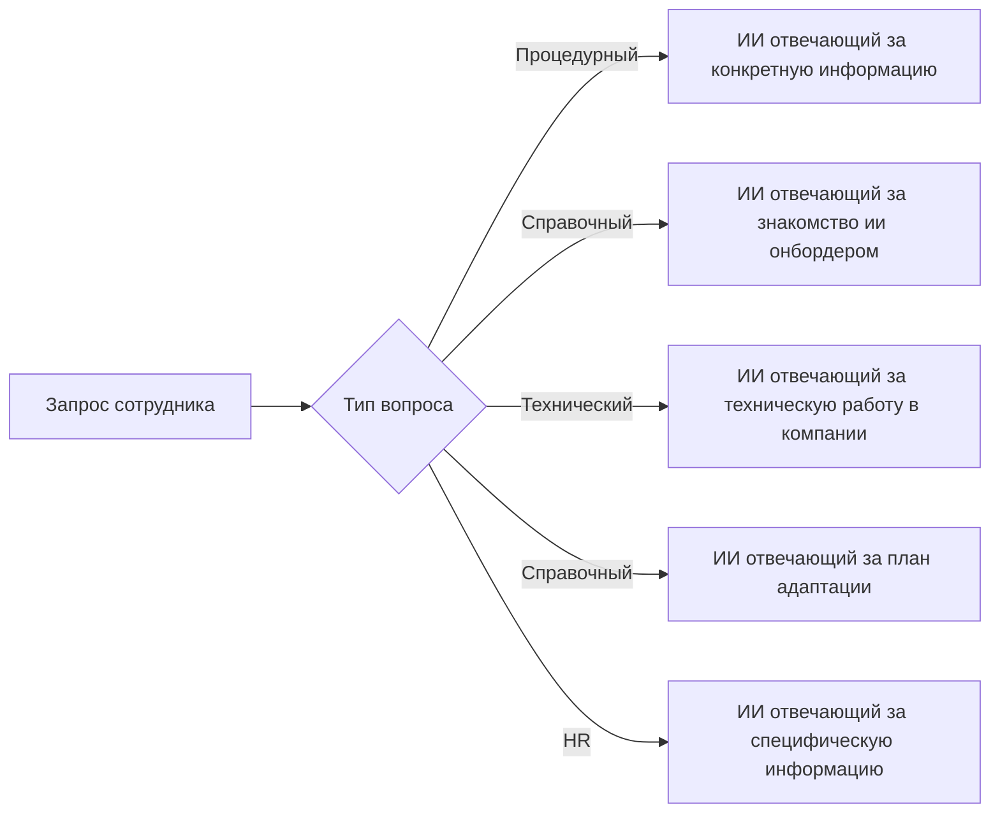

# ИИ-ассистент онбордера сотрудников  
**Версия документа:** 1.0  
**Автор:** Яков
## 1. Введение
### 1.1 Назначение
Документ определяет технические требования к системе ИИ-ассистента для адаптации новых сотрудников.
### 1.2 Область действия
Система включает: backend-сервер, AI-интеграцию и веб-интерфейс(либо Telegram Bot).
### 1.3 Определения и сокращения
| Термин | Определение                 |
| ------ | --------------------------- |
| NLP    | Natural Language Processing |
| HRM    | Human Resource Management   |
| RBAC   | Role-Based Access Control   |
## 2. Общее описание
	(подумать как собирать данные)
### 2.1 Архитектурное решение(Sureal DB)

### 2.2 Архитектура ИИ агентов(Переделать)

### 2.2 Технологический стек
- **Backend:** Kotlin
- **AI:** GPT-4/LLaMA3 + RAG
- **Базы данных:** PostgreSQL (основная), Redis (кэш)
- **Интеграции:** Apache Kafka, REST API
## 3. Детальные требования

### 3.1 Функциональные требования

#### 3.1.1 Модуль адаптации
| ID    | Требование                                                                   | Критерий оценки                  |
| ----- | ---------------------------------------------------------------------------- | -------------------------------- |
| FR1.1 | Система должна формировать индивидуальный план адаптации на основе должности | Сформированный заранее план      |
| FR1.2 | Интеграция с календарями Outlook/Google Calendar                             | Синхронизация в реальном времени |
#### 3.1.2 База знаний

### 3.2 Требования к данным

#### 3.2.1 Структуры данных
**Employee Profile:**
```json
{
  "employee_id": "UUID",
  "position": "String",
  "department": "String",
  "access_level": "Enum[1-5]",
  "onboarding_stage": "Enum[1-10]"
}
```
#### 3.2.2 Хранение документов
- Форматы: PDF, DOCX, Markdown
- Макс. размер: 25MB на документ
- Версионность: Git история изменений
### 3.4 Нефункциональные требования

#### 3.4.1 Производительность
| Параметр           | Значение |
| ------------------ | -------- |
| Время отклика UI   | ≤1.2 сек |
| Обработка запросов | ≤3 сек   |
| Макс. нагрузка     | 1000 RPS |
#### 3.4.2 Безопасность
- Аутентификация: OAuth 2.0 + JWT
- Шифрование: AES-256 для данных