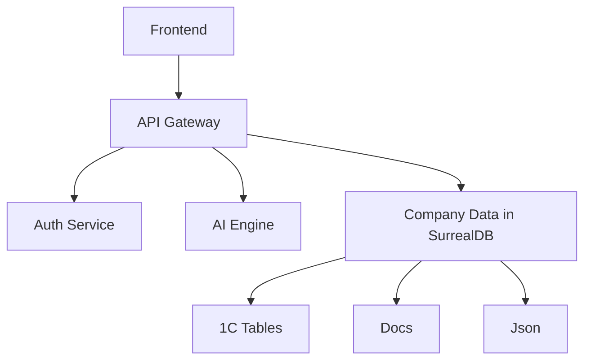
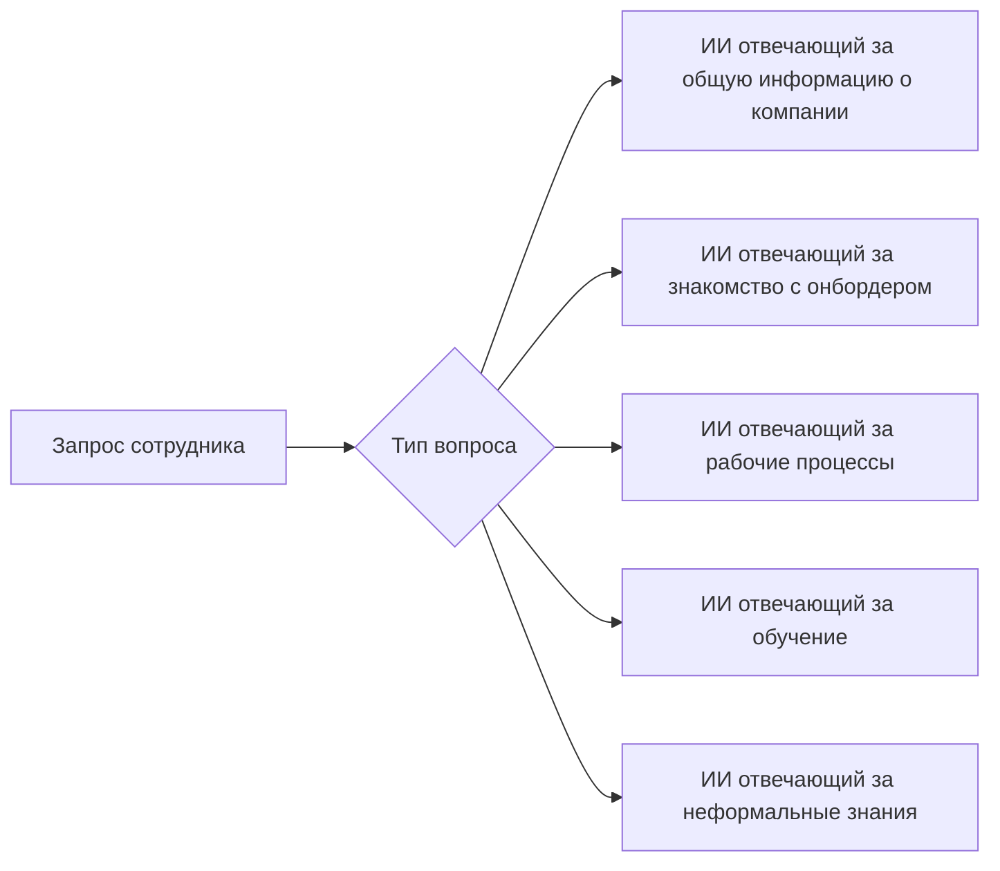

**Версия документа:** 1.0  
**Автор:** Яков

### **1. Введение**  
#### 1.1 Назначение  
Документ определяет технические требования к системе ИИ-ассистента для адаптации новых сотрудников.  

#### 1.2 Область действия  
Система включает:  
- Backend-сервер  
- AI-интеграцию  
- Веб-интерфейс или Telegram Bot.  
### **2. Общее описание**  
#### 2.1 Архитектурные решения  
##### 2.1.1 База данных (SurrealDB)  


##### 2.1.2 Архитектура ИИ-агентов  


#### 2.2 Технологический стек  
- **Backend:** Kotlin+Ktor
- **AI:** GPT-4/LLaMA3
- **База данных:**  
  - SurrealDB    
- **Интеграции:** Apache Kafka, REST API  

---

### **3. Детальные требования**  
#### 3.1 Функциональные требования  
##### 3.1.1 Модуль адаптации  
| ID    | Требование                                                                                         | Критерий оценки                  |
| ----- | -------------------------------------------------------------------------------------------------- | -------------------------------- |
| FR1.1 | Система должна анализировать индивидуальный план адаптации на основе должности, помогая в обучении | Обучение соответствующее плану   |
| FR1.2 | Интеграция с календарями Outlook/Google Calendar                                                   | Синхронизация в реальном времени |
| FR1.3 | Интеграция с 1С                                                                                    | Синхронизация в реальном времени |


##### 3.1.2 База знаний  


#### 3.2 Требования к данным  
##### 3.2.1 Структуры данных  
**Employee Profile:**  
```json  
{  
  "employee_id": "UUID",  
  "position": "String",  
  "department": "String",  
  "access_level": "Enum[1-5]",  
  "onboarding_stage": "Enum[1-10]"  
}  
```  

##### 3.2.2 Хранение документов  
Хранение данных происходит с помощью SurrealDB в различных форматах: PDF, DOCX, Markdown, и др. 
#### 3.3 Нефункциональные требования  
##### 3.3.1 Производительность  
| Параметр           | Значение |  
| ------------------ | -------- |  
| Время отклика UI   | ≤1.2 сек |  
| Обработка запросов | ≤3 сек   |  
| Макс. нагрузка     | 1000 RPS |  

##### 3.3.2 Безопасность  
- **Аутентификация:** OAuth 2.0 + JWT  
- **Шифрование:** AES-256 для данных  

---

### **4. Реализация SurrealDB**(Record refference)  
#### 4.1 Сохранение файлов  
##### Как BLOB (бинарные данные)  
```kotlin  
suspend fun uploadDocxToSurreal() {  
    val client = HttpClient(CIO)  
    val fileContent = File("договор.docx").readBytes()  
    val response: HttpResponse = client.post("http://localhost:8000/sql") {  
        setBody("""  
            INSERT INTO documents {  
                name: "Договор.docx",  
                type: "docx",  
                content: ${fileContent.contentToString()},  
                meta: { author: "Иван Иванов" }  
            };  
        """.trimIndent())  
        header("Accept", "application/json")  
        header("NS", "test")  
        header("DB", "test")  
    }  
    println(response.bodyAsText())  
}  
```  

#### 4.2 Извлечение данных  
```sql  
SELECT content FROM documents WHERE name = "Договор.docx";  
```  

#### 4.3 Просмотр через веб-интерфейс  
```kotlin  
fun main() {  
    embeddedServer(Netty, port = 8080) {  
        routing {  
            get("/doc/{id}") {  
                val docId = call.parameters["id"]!!  
                val content = fetchFromSurreal("SELECT content FROM $docId;")  
                val doc = XWPFDocument(ByteArrayInputStream(content))  
                val text = doc.paragraphs.joinToString("\n") { it.text }  
                call.respondText(text)  
            }  
        }  
    }.start(wait = true)  
}  
```  
