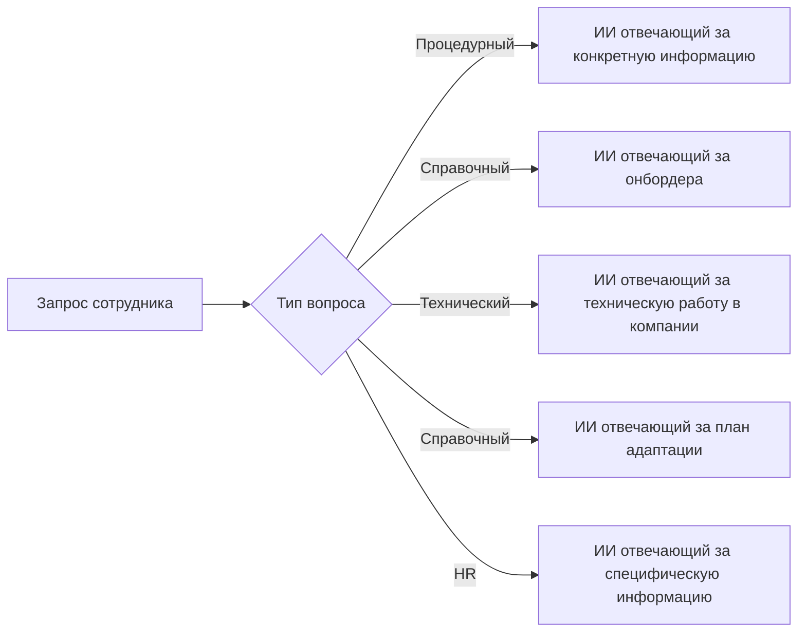

## Этапы
## 1. Вводный этап: Инструкция по работе с ИИ-ассистентом (День 1)

### 1.1 Первый запуск системы
- **Активация помощника**  
  ▶️ *Действие сотрудника:*  
  - Открыть корпоративный портал → раздел "Цифровой помощник"  
  - Пройти двухфакторную аутентификацию  

  💡 *Что делает ИИ:*  
  - Анализирует должность и отдел  
  - Генерирует индивидуальный план адаптации  

### 1.2 Изучение основных команд и функций
#### 1.2.1**Чат-команды**  
`/документы` → список обязательных документов для ознакомления  
`/ментор` → контакты назначенного наставника  
#### 1.2.2 Функции
 1. 🏠 Главная панель - ваш цифровой офис  
  2. 📅 Календарь адаптации - все события в одном месте  
  3. 📚 База знаний - ответы на типовые вопросы  
  4. 🆘 Экспресс-помощь - подключение живого специалиста  
  5. 📊 Прогресс - ваши достижения и следующие шаги  
**Чат:**
Ментор может проверять прогресс адаптации сотрудника


### 1.3 Практическое задание
*Цель:* Найти ответ на вопрос через 3 разных способа  

| Пример запроса          | Критерий выполнения               |
| ----------------------- | --------------------------------- |
| "Как заказать пропуск?" | Получен точный ответ              |
| /пропуск                | Ссылка на форму + контакты охраны |
### 1.4 Система подсказок
Подсказки и напоминания для пользователя о важных вещах.  
**Важно:**  
- Все взаимодействия логируются для улучшения системы  
- Доступна история всех диалогов в личном кабинете  
## 2. Этап знакомства (1-2 недели)
  - Получение персонального плана адаптации
  - Встречи с ключевыми коллегами (запись в календарь) с сумаризацией итогов
  - Знакомство с материалами о компании
- **Тематические модули:**
	Сделать структурирование как в описании онбордера

| Модуль                 | Формат               |
| ---------------------- | -------------------- |
| Корпоративная культура | Нормативный документ |
| Продуктовый ликбез     | Видео+тестирование   |
| Техническая база       | Практические задания |

## 3. Интеграция в рабочую деятельность (3-4 недели)
- **Вхождение в рабочую деятельности
  - Доступ к проектной документации
  - Формирование рабочего плана задач
- **Тренажеры рабочих процессов**
  - Симуляция типовых задач, либо задачи назначенные руководителем
  - Шаблоны документов

## 4. Аттестационный этап (1-3 месяца)
*"Финальная проверка знаний"*

- **Многоуровневая аттестация**
  ```mermaid
  pie
    title Структура оценки
    "Результаты текущей деятельности" : 50
    "Общие знания о компании и стандарты" : 15
    "Специализированные знанию" : 25
    "Социальная адаптация в форме обратной связи от команды" : 10
  ```
- **Инструменты проверки:**
  - Кейс-тесты с реальными рабочими ситуациями
  - Автоматический отчет для ментора
	Сделать workflow по прохождению аттестаций, встречами с ментором и т.д.
## 5. Постоянная поддержка (После адаптации)
- **Режим "Помощник"**
  - Ответы на сложные вопросы
  - Напоминания о задачах
  - Обновление знаний при изменениях
- **Система развития:**
  - Рекомендации курсов
  - Карьерные треки
## Реализация этапов (Пример)
**Сценарий дня №1 для разработчика:**
1. 09:00 - Приветствие через мобильное приложение
2. 09:15 - Квест по настройке IDE
3. 10:00 - Виртуальная экскурсия по кодовой базе
4. 11:00 - Автоматизированный код-ревью первого коммита(с возможность ручной проверки)

**Критерии успеха:**
- 100% выполнение чек-листов первых 3 дней
- Прохождение аттестации с результатом ≥85%
- Положительная обратная связь от ментора