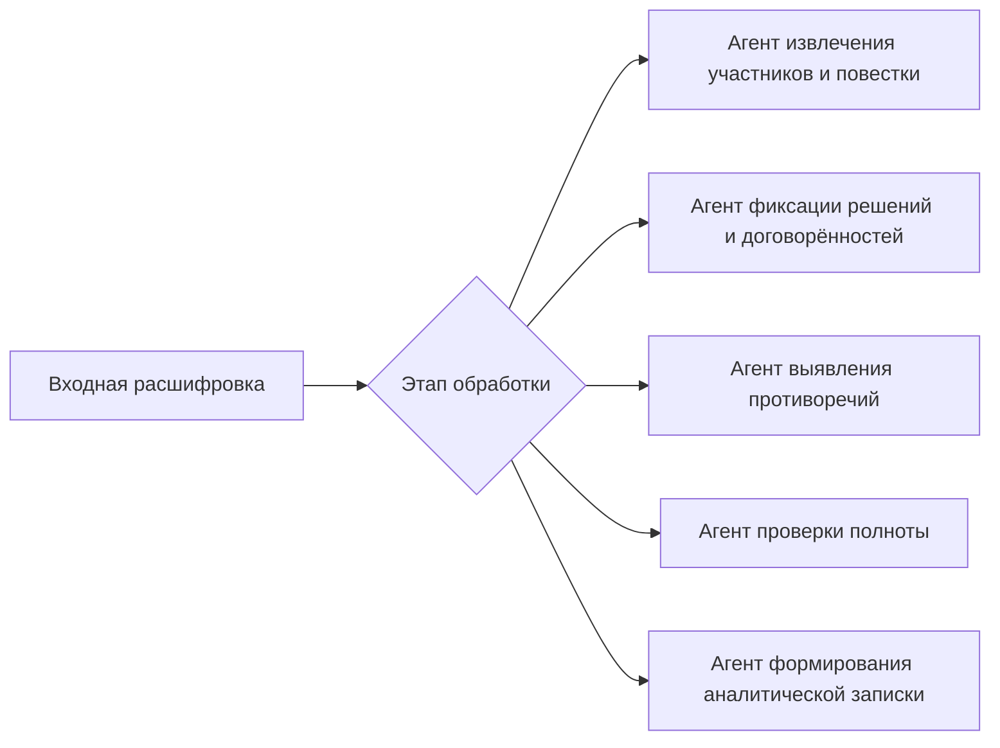
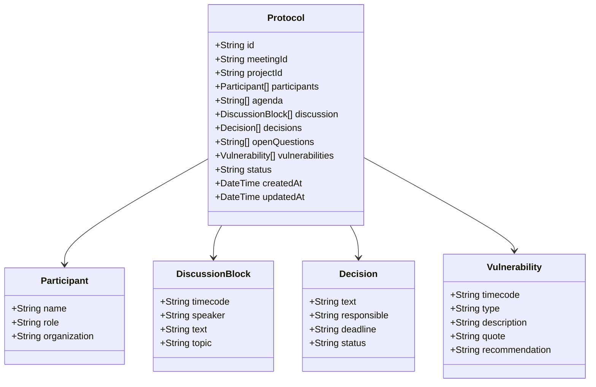

# **Технические требования к ИИ-протоколеру**
**Версия документа:** 1.0

### **1. Введение**

#### 1.1 Назначение
Документ определяет технические требования к системе ИИ-ассистента для подготовки протоколов обследования на основе записей и расшифровок встреч с заказчиком.

#### 1.2 Область действия
Система включает:
- Backend-сервер
- AI-модуль (AI SDK, поддержка нескольких LLM)
- Веб-интерфейс (React)
- Модуль транскрибации (Speech-to-Text)
- Модуль экспорта документов (DOCX)

### **2. Общее описание**

#### 2.1 Архитектурные решения
##### 2.1.1 Общая архитектура системы
```mermaid
graph TD
    A[React Frontend] --> B[API Gateway / Ktor]
    B --> C[Auth Service — JWT]
    B --> D[AI Engine — AI SDK]
    B --> E[SurrealDB]
    B --> F[Speech-to-Text Service]
    B --> G[DOCX Export Module]
    E --> H[Meetings]
    E --> I[Protocols]
    E --> J[Projects]
    E --> K[Analytics Reports]
````

##### 2.1.2 Архитектура AI-пайплайна

``` mermaid
flowchart LR
    A[Запись / расшифровка встречи] --> B{Тип входа}
    B -->|Аудио| C[Speech-to-Text]
    B -->|Текст| D[Предобработка]
    C --> D
    D --> E[Извлечение структурированных данных]
    E --> F[Формирование протокола]
    E --> G[Выявление уязвимых мест]
    F --> H[Проект протокола]
    G --> H
    H --> I[Ручная доработка]
    I --> J[Финальный протокол]
    J --> K[Аналитическая записка]
```

##### 2.1.3 Архитектура AI-агентов




#### 2.2 Технологический стек

| Компонент              | Технология                                  |
| ---------------------- | ------------------------------------------- |
| **Backend**            | Next.js                                     |
| **Frontend**           | React                                       |
| **AI**                 | AI SDK (GPT-4 / LLaMA 3 / другие через API) |
| **Speech-to-Text**     | Whisper API / аналоги                       |
| **База данных**        | SurrealDB                                   |
| **Экспорт документов** | (DOCX)                                      |
| **Контейнеризация**    | Docker, Docker Compose                      |
| **Аутентификация**     | Логин и пароль                              |

---

### **3. Детальные требования**

#### 3.1 Функциональные требования

##### 3.1.1 Модуль обработки встреч

| ID    | Требование                                                          | Критерий оценки                  |
| ----- | ------------------------------------------------------------------- | -------------------------------- |
| FR1.1 | Система должна принимать аудиозаписи встреч (MP3, WAV,)             | Успешная загрузка файлов         |
| FR1.2 | Система должна принимать текстовые расшифровки                      | Корректный парсинг текста        |
| FR1.3 | Система должна выполнять транскрибацию аудио с разметкой спикеров   | Точность распознавания речи ≥95% |
| FR1.4 | Система должна размечать тайм-коды для каждого фрагмента обсуждения | Точность тайм-кодов ±3 сек       |

##### 3.1.2 Модуль генерации протоколов

|ID|Требование|Критерий оценки|
|---|---|---|
|FR2.1|Система должна генерировать структурированный проект протокола|Протокол содержит все обязательные разделы|
|FR2.2|Система должна выделять решения и договорённости с указанием ответственных|Точность извлечения решений ≥97%|
|FR2.3|Система должна выявлять уязвимые места с привязкой к тайм-кодам|Обнаружение ≥90% противоречий|
|FR2.4|Система должна отделять факты от предположений проектной команды|Корректная маркировка в ≥95% случаев|
|FR2.5|Система должна экспортировать протоколы в формат DOCX|Корректное форматирование документа|
|FR2.6|Система должна поддерживать ручное редактирование протокола|Сохранение всех пользовательских правок|

##### 3.1.3 Модуль аналитики

| ID    | Требование                                                                  | Критерий оценки                          |
| ----- | --------------------------------------------------------------------------- | ---------------------------------------- |
| FR3.1 | Система должна формировать аналитическую записку на основе серии протоколов | Записка содержит сводку решений и рисков |
| FR3.2 | Система должна отслеживать динамику изменения требований между встречами    | Корректное выявление изменений           |
| FR3.3 | Система должна обеспечивать навигацию и поиск по ранее созданным протоколам | Время поиска ≤3 сек                      |

##### 3.1.4 Модель данных протокола




#### 3.2 Требования к данным

##### 3.2.1 Структуры данных

**Meeting (Встреча):**


```JSON
{
    "id": "UUID",
    "projectId": "UUID",
    "rawTranscript": "String",
    "annotatedTranscript": "String",
    "duration": "Number (seconds)",
    "audioFileRef": "String (optional)",
    "createdAt": "DateTime"
}
```

**Protocol (Протокол):**


```JSON
{
    "id": "UUID",
    "meetingId": "UUID",
    "projectId": "UUID",
    "participants": [
        {
            "name": "String",
            "role": "String",
            "organization": "String"
        }
    ],
    "agenda": ["String"],
    "discussion": [
        {
            "timecode": "HH:MM:SS",
            "speaker": "String",
            "text": "String",
            "topic": "String"
        }
    ],
    "decisions": [
        {
            "text": "String",
            "responsible": "String",
            "deadline": "String",
            "status": "Enum[new, confirmed, changed, cancelled]"
        }
    ],
    "openQuestions": ["String"],
    "vulnerabilities": [
        {
            "timecode": "HH:MM:SS",
            "type": "Enum[contradiction, assumption, ambiguity, unanswered, changed_position]",
            "description": "String",
            "quote": "String",
            "recommendation": "String"
        }
    ],
    "status": "Enum[draft, review, approved]",
    "createdAt": "DateTime",
    "updatedAt": "DateTime"
}
```

**User (Пользователь):**


```JSON
{
    "user_id": "UUID",
    "username": "String",
    "email": "String",
    "role": "Enum[analyst, manager, admin]",
    "department": "String"
}
```

##### 3.2.2 Хранение документов

Хранение данных осуществляется в SurrealDB. Аудиофайлы сохраняются в файловом хранилище с ссылкой из БД в виде векторов. Протоколы и расшифровки хранятся как структурированные записи.

#### 3.3 Нефункциональные требования

##### 3.3.1 Производительность

|Параметр|Значение|
|---|---|
|Время отклика UI|≤1.5 сек|
|Транскрибация аудио (1 час)|≤10 мин|
|Генерация протокола|≤60 сек|
|Экспорт в DOCX|≤5 сек|
|Точность генерации|≥97%|
|Макс. размер аудиофайла|500 МБ|

##### 3.3.2 Безопасность

- **Аутентификация:** OAuth 2.0 + JWT
- **Шифрование:** AES-256 для хранимых данных, TLS для передачи
- **Размещение:** Локальное, внутри периметра компании
- **Аудит:** Логирование всех действий пользователей

##### 3.3.3 Масштабируемость

- Поддержка контейнеризации (Docker)
- Горизонтальное масштабирование backend-сервисов
- Возможность подключения различных LLM через единый AI SDK

---

### **4. Реализация SurrealDB**

#### 4.1 Хранение расшифровок встреч

Kotlin

```
suspend fun saveMeetingTranscript(db: Surreal, meeting: Meeting) {
    val response = db.query("""
        CREATE meeting:${meeting.id} CONTENT {
            projectId: project:${meeting.projectId},
            rawTranscript: ${'$'}rawTranscript,
            annotatedTranscript: ${'$'}annotatedTranscript,
            duration: ${meeting.duration},
            createdAt: time::now()
        }
    """, mapOf(
        "rawTranscript" to meeting.rawTranscript,
        "annotatedTranscript" to meeting.annotatedTranscript
    ))
}
```

#### 4.2 Хранение протоколов

Kotlin

```
suspend fun saveProtocol(db: Surreal, protocol: Protocol) {
    db.query("""
        CREATE protocol:${protocol.id} CONTENT {
            meetingId: meeting:${protocol.meetingId},
            projectId: project:${protocol.projectId},
            participants: ${'$'}participants,
            decisions: ${'$'}decisions,
            vulnerabilities: ${'$'}vulnerabilities,
            status: "${protocol.status}",
            createdAt: time::now()
        }
    """, mapOf(
        "participants" to Json.encodeToString(protocol.participants),
        "decisions" to Json.encodeToString(protocol.decisions),
        "vulnerabilities" to Json.encodeToString(protocol.vulnerabilities)
    ))
}
```

#### 4.3 Поиск по протоколам

SQL

```
-- Поиск решений по ключевым словам
SELECT decisions FROM protocol
WHERE projectId = project:$projectId
AND decisions[*].text CONTAINS $keyword;

-- Все уязвимые места по проекту
SELECT vulnerabilities FROM protocol
WHERE projectId = project:$projectId
AND array::len(vulnerabilities) > 0
ORDER BY createdAt DESC;
```

#### 4.4 Связи между сущностями

SQL

```
-- Связь протокола с встречей и проектом
SELECT *,
    meetingId.rawTranscript AS transcript,
    projectId.name AS projectName
FROM protocol
WHERE id = protocol:$id
FETCH meetingId, projectId;
```

text

````

---

# Документ 4: Функциональные требования

```markdown
# **Функциональные требования к ИИ-протоколеру**
**Версия документа:** 1.0

## 1. Основные функциональные блоки

### 1.1 Обработка записей встреч
- Загрузка аудио/видеозаписей встреч (MP3, WAV, OGG, M4A)
- Загрузка готовых текстовых расшифровок
- Автоматическая транскрибация аудио:
  - Распознавание речи с точностью ≥95%
  - Разметка спикеров (speaker diarization)
  - Генерация тайм-кодов для каждого фрагмента
- Предобработка текста:
  - Удаление шума и нерелевантных фрагментов
  - Нормализация текста
  - Определение тематических блоков обсуждения

### 1.2 Генерация протоколов обследования
- Формирование структурированного проекта протокола, включающего:
  - **Участники**: имена, роли, организация
  - **Повестка**: перечень обсуждавшихся вопросов
  - **Ход обсуждения**: структурированная фиксация дискуссии с тайм-кодами
  - **Решения и договорённости**: текст решения, ответственный, срок
  - **Открытые вопросы**: вопросы, оставшиеся без ответа
  - **Уязвимые места**: фрагменты, требующие верификации, с тайм-кодами
- Точность генерации — **97%+**
- Все решения привязаны к конкретным высказываниям участников

### 1.3 Контроль качества протокола
- Выявление уязвимых мест:
  - **Противоречия** — несогласованные высказывания разных участников
  - **Предположения** — фиксация предположений проектной команды вместо ответов заказчика
  - **Неоднозначности** — формулировки, допускающие двоякое толкование
  - **Без ответа** — вопросы, на которые не был дан чёткий ответ
  - **Изменение позиции** — ситуации, когда участник изменил ранее высказанную позицию
- Каждое уязвимое место сопровождается:
  - Тайм-кодом в записи
  - Типом проблемы
  - Цитатой из расшифровки
  - Рекомендацией по уточнению
- Проверка полноты: сопоставление повестки с зафиксированными решениями

### 1.4 Доработка и утверждение протокола
- Ручное редактирование всех разделов протокола через веб-интерфейс
- Возможность добавления комментариев и примечаний
- Статусная модель:
  - **Черновик** (draft) — сформирован ИИ
  - **На проверке** (review) — передан проектной команде для доработки
  - **Утверждён** (approved) — финальная версия
- История изменений с указанием автора и времени правки

### 1.5 Экспорт документов
- Экспорт протокола в формат **DOC/DOCX**:
  - Корректное форматирование (заголовки, списки, таблицы)
  - Выделение уязвимых мест цветом
  - Колонтитулы с метаданными (проект, дата, номер протокола)
- Экспорт аналитической записки в DOCX
- Возможность настройки шаблона документа

## 2. Навигация и управление проектами

### 2.1 Управление проектами
- Создание и ведение проектов обследования
- Привязка встреч и протоколов к проекту
- Дашборд проекта:
  - Список встреч и протоколов
  - Сводка ключевых решений
  - Список открытых вопросов
  - Количество нерешённых уязвимых мест

### 2.2 Поиск и навигация
- Полнотекстовый поиск по всем протоколам проекта
- Поиск по решениям и договорённостям
- Фильтрация протоколов по статусу, дате, проекту
- Навигация по тайм-кодам — переход к конкретному моменту обсуждения

### 2.3 Аналитическая записка
- Формирование сводного документа на основе серии протоколов:
  - Общая сводка по результатам обследования
  - Консолидированный перечень решений и их текущий статус
  - Перечень нерешённых вопросов и рисков
  - Динамика изменения требований от встречи к встрече
  - Рекомендации для следующих этапов
- Возможность выбора протоколов для включения в записку

## 3. Интеграционные возможности

### 3.1 AI-модели
- Поддержка работы с различными LLM через AI SDK:
  - GPT-4 и аналоги через API
  - LLaMA 3 и аналоги для локального развёртывания
- Возможность переключения между моделями без изменения кода
- Настройка параметров генерации (температура, max tokens и др.)

### 3.2 Speech-to-Text
- Интеграция с сервисами распознавания речи:
  - Whisper API или аналоги
  - Поддержка русского языка
- Возможность замены STT-сервиса без изменения основного кода

### 3.3 Персонализация и настройка
- Настройка шаблона протокола под требования заказчика
- Настройка обязательных и необязательных разделов
- Добавление кастомных полей в протокол
- Управление правами доступа по ролям:
  - **Аналитик** — загрузка встреч, генерация и редактирование протоколов
  - **Руководитель проекта** — просмотр, утверждение, аналитика
  - **Администратор** — управление пользователями, настройка системы

## 4. Администрирование системы

### 4.1 Управление контентом
- Добавление и удаление проектов
- Управление пользователями и правами доступа
- Настройка шаблонов протоколов
- Управление подключёнными AI-моделями и STT-сервисами

### 4.2 Аналитика использования
- Статистика по количеству обработанных встреч и сгенерированных протоколов
- Среднее время генерации протокола
- Процент протоколов, утверждённых без доработки
- Частота выявляемых типов уязвимых мест
- Объём внесённых ручных правок (как метрика качества ИИ)

### 4.3 Логирование и аудит
- Логирование всех действий пользователей
- История изменений каждого протокола
- Мониторинг производительности AI-модуля
- Отслеживание ошибок и сбоев